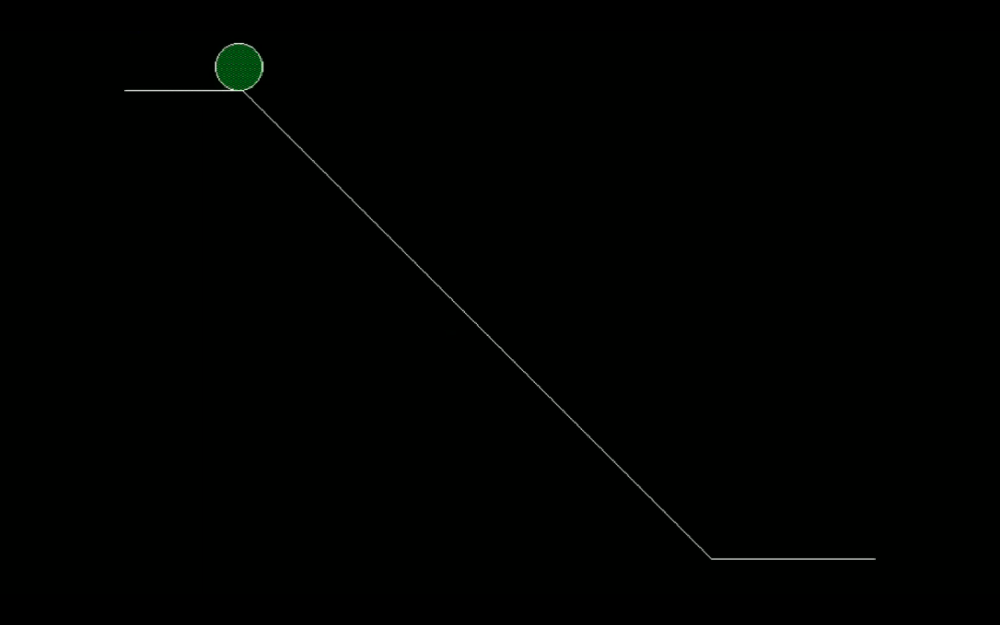

# Rolling-Ball-Animation-Using-Computer-Graphics

Technologies used: C Programming Language (in Turbo C)

Project Overview:
This project implements a 2D animation of a ball rolling down an inclined plane. The goal was to understand fundamental computer graphics concepts such as drawing primitives, filling shapes, and creating basic animations using procedural C programming.

Key Graphics (graphics.h) Functions Used:
* line() – Used to draw the inclined plane
* circle() – Used to represent the rolling ball
* setfillstyle() – Sets the fill pattern and color for the ball
* floodfill() – Fills the ball with the selected pattern and color
* delay() – Controls animation speed by introducing time delays between frames

Animation Details:
+ The ball’s position is updated frame-by-frame to simulate rolling motion
+ Delays are applied to create visible animation transitions

Possible Improvements:
* Enhance realism by incorporating physics-based motion (acceleration, friction)
* Improve visual appeal with smoother transitions and scene elements

Graphics functions reference: https://graphicswithc.wordpress.com/all-about-built-in-graphics-functions/

# Animation/Output:

